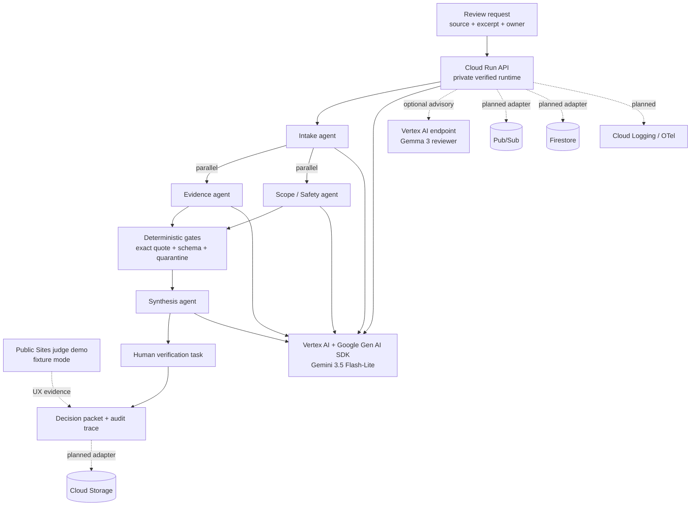

# VerdictFlow architecture

> Implementation note: this document describes the target Google Cloud
> architecture. The current deployed MVP uses Cloud Run + Vertex AI, with a
> local file repository and local async bus. Multi-agent fan-out is implemented
> inside the Gemini provider; the optional Gemma advisory adapter calls a
> separately deployed Vertex endpoint when configured. Pub/Sub, Firestore,
> Cloud Storage, and ADK remain planned infrastructure adapters.

## Product boundary

VerdictFlow governs an AI-generated signal after it exists. It does not make a
publication recommendation. It does not infer that an entire paper lacks a
property merely because a supplied excerpt does not show it. It does not
contact authors in the retrospective public-paper demonstration.

The system must be able to answer:

1. What source material was in scope?
2. What did the model claim?
3. Which exact evidence supports that claim?
4. What was verified, inferred, missing, or contradictory?
5. Which permissions and policy version were active?
6. Who accepted, rejected, modified, or escalated the finding?
7. What happened after the decision?

## Logical architecture



The dashed services are not represented as implemented in the current MVP.
The public Sites page is a fixture-mode judge surface; the Cloud Run endpoint
is the authenticated live Gemini/Vertex AI evidence surface. Gemma is an
optional advisory path and is not claimed as live unless a deployed endpoint
and smoke-test evidence are present.

## Google services

| Component | Responsibility | Required evidence |
|---|---|---|
| Gemini 3.5+ / Vertex AI | Claim extraction, bounded question generation, synthesis | Model/version and request trace |
| Google ADK | Agent definitions, delegation, sequential/parallel/loop workflow | Agent graph and run logs |
| Cloud Run | API and worker service | Service URL, revision, health response |
| Pub/Sub | Durable asynchronous jobs and retries | Topic, message ID, retry/dead-letter event |
| Firestore | Runs, findings, dispositions, decision versions | Document IDs and state transitions |
| Cloud Storage | Source files and generated packets | Object IDs and checksums |
| Cloud Logging/OpenTelemetry | Structured execution and audit trace | Correlated trace/run IDs |
| Model Armor, if enabled | Document/tool-input guardrails | Blocked-input event |

## Agent responsibilities

### Intake Agent

Allowed to extract claims, citations, source boundaries, and document metadata.

Not allowed to decide whether a claim is true or make an accept/reject
recommendation.

### Evidence Check Agent

Allowed to link a candidate finding to an exact supplied quote or structured
source record.

Must emit `not_established` when the supplied material cannot prove absence or
presence. It cannot silently use knowledge outside the declared source scope.

### Scope and Safety Agent

Checks public-material confirmation, prompt-injection indicators, unsupported
authority requests, privacy constraints, and whether the requested check is in
the allowed scope.

### Synthesis Agent

Combines validated findings and disagreements into a review packet. It may
describe uncertainty and recommend escalation. It cannot create new factual
findings that are absent from validated inputs.

### Follow-up Agent

Creates bounded verification tasks and routes them to the named human owner.
For the public-paper demo it does not contact authors or external parties.

## Orchestration pattern

```text
Sequential: Intake -> scope check -> claim extraction
Parallel:   evidence check + completeness check + citation consistency check
Loop:       disagreement/missing evidence -> bounded follow-up -> re-check
Gate:       all findings have human dispositions before closure
```

## Failure handling

- Every job has an idempotency key: `runId + step + inputVersion`.
- Pub/Sub retries transient failures and sends exhausted messages to a dead-letter queue.
- Invalid model JSON fails the individual finding, not the entire run.
- Evidence-gate failures are terminal for that finding and recorded as such.
- No fallback provider may be presented as Gemini or Vertex AI.
- A run cannot close while any finding lacks a disposition.
- A changed finding supersedes, but does not delete, the previous outcome.
